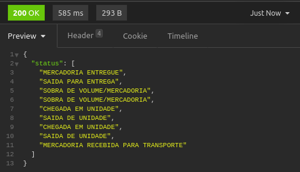
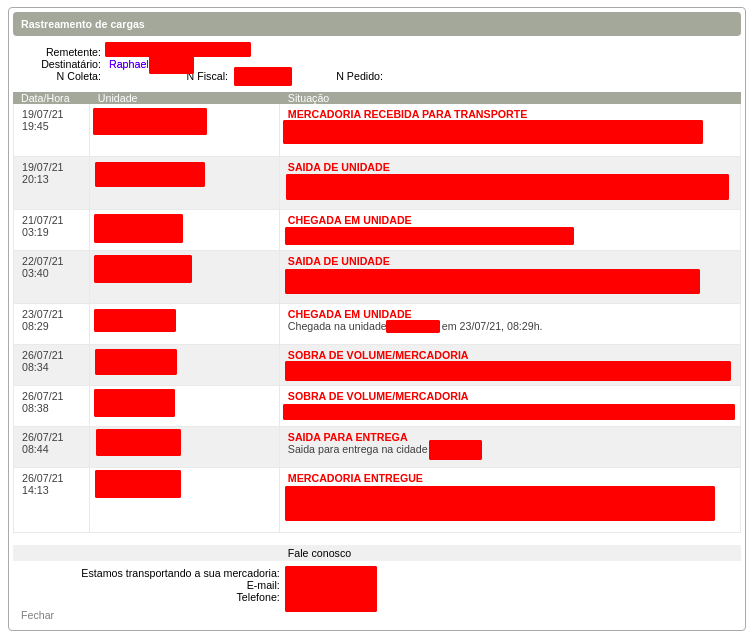

# incoming-track
A scraping api with flask for tracking pages.

API            |  Tracking
:-------------------------:|:-------------------------:
  |  

# Run

```bash
flask run
```

# Requirements
Flask            |  BeautifulSoup
:-------------------------:|:-------------------------:
  |  


# Why ❓️

For those tracking methods that don't provide API (mosts of them ?!) and people that are anxious enough to verify the status time by time, it comes with the idea of scraping the data out of its page.

# Endpoint 🚩
The endpoint is */status* and shall return a json list with the status.

# Configs ⚙️
The setup is composed of two pieces:
* Create a file with the name *page.py* and a variable called *PAGE_LINK* with the tracking link.
* Adjust the searching method to the chosen page.
# Calibration 🧭
The search method looks for a list of tags "p" with class "titulo". Probably it won't be your case so adjust the search to the logic within your page. Be clever!

# Improvments or Suggestions
* Deploy to a server(firebase gcloud, heroku)
* Implement ready to use most famous tracking methods